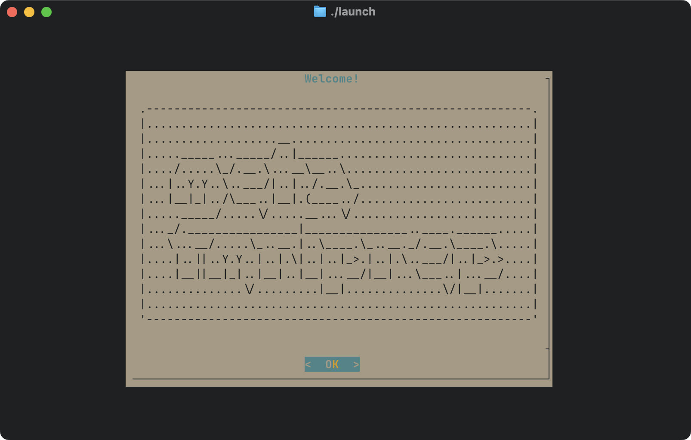
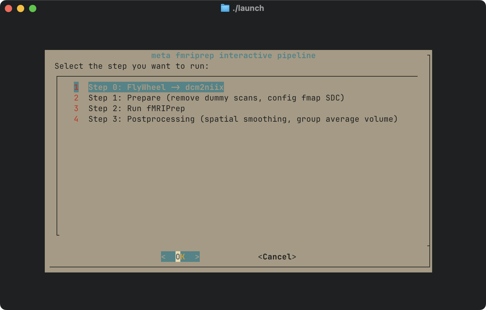
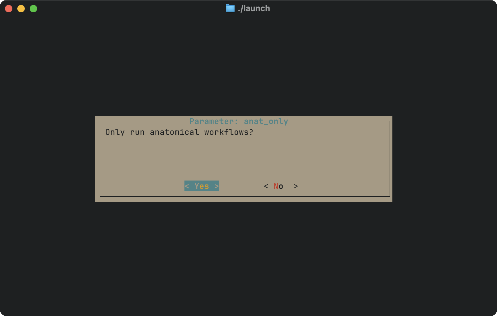

<h2 align="center">SML fMRI Preprocessing Template<br />(<em>aka, meta fmriprep</em>)</h2>

    ███████╗███╗   ███╗██████╗ ██╗
    ██╔════╝████╗ ████║██╔══██╗██║
    █████╗  ██╔████╔██║██████╔╝██║
    ██╔══╝  ██║╚██╔╝██║██╔══██╗██║
    ██║     ██║ ╚═╝ ██║██║  ██║██║
    ╚═╝     ╚═╝     ╚═╝╚═╝  ╚═╝╚═╝

    ██████╗ ██╗██████╗ ███████╗██╗     ██╗███╗   ██╗███████╗
    ██╔══██╗██║██╔══██╗██╔════╝██║     ██║████╗  ██║██╔════╝
    ██████╔╝██║██████╔╝█████╗  ██║     ██║██╔██╗ ██║█████╗
    ██╔═══╝ ██║██╔═══╝ ██╔══╝  ██║     ██║██║╚██╗██║██╔══╝
    ██║     ██║██║     ███████╗███████╗██║██║ ╚████║███████╗
    ╚═╝     ╚═╝╚═╝     ╚══════╝╚══════╝╚═╝╚═╝  ╚═══╝╚══════╝

This repo is a work in progress intended to transform the [Stanford Memory Lab's](https://memorylab.stanford.edu/) (SML) internal fMRI preprocessing scripts into a generalizable workflow for consistency within and across lab projects.

As such, this repo is intended to be used as a **GitHub template** for setting up fMRI preprocessing pipelines that handle:

- [x] 1. automated transfer of scanner acquisitions from FlyWheel -> Server
- [x] 2. Raw -> BIDS format
- [x] 3. `dcm2niix` DICOM to NIfTI converter,
- [x] 4. dummy scan removal + setup files for fieldmap-based susceptibility distortion correction in fMRIPrep,
- [x] 5. Run fMRIPrep anatomical workflows only (if doing manual edits, otherwise skip to step 8)
- [ ] 6. Download Freesurfer output for manual surface editing
- [ ] 7. Reupload edited Freesurfer directories
- [ ] 8. Run remaining fMRIPrep steps
- [ ] 9. automated tools for HDF5 file management and compression out of the box (i.e., to limit lab inode usage on OAK storage)

> [!NOTE]
> - [x] indicates workflows that have been finished and validated
> - [ ] indicates workflows that are still under active development

## Using this Template

1. Click the "Use this template" button at the top of this repository
2. Select "Create a new repository"
3. Choose a name for your repository
4. Select whether you want it to be public or private
5. Click "Create repository from template"

This will create a new repository with all the files from this template, allowing you to customize it for your specific preprocessing needs while maintaining the core functionality for handling:

- Fieldmap-based distortion correction
- Dummy scan removal
- BIDS-compliance
- JSON metadata management
- Quality control checks

The template provides a standardized structure and validated scripts that you can build upon, while keeping your specific study parameters and paths separate in configuration files.

## What's Included

- Preprocessing scripts for handling fieldmaps and dummy scans
- Configuration templates and examples
- Documentation and usage guides
- Quality control utilities
- BIDS metadata management tools
- An interactive terminal user interface (TUI) launcher for triggering pipeline steps

## Getting Started

After creating your repository from this template:

1. Clone your new repository
2. Copy `settings.template.sh` to `settings.sh` and customize parameters
3. Modify paths and scan parameters for your study
4. Follow the `configuration guide` in the detailed documentation below

---

# SML fMRI Configuration Guide

## Overview
The preprocessing pipeline requires proper configuration of several parameters to handle your study's specific requirements. This guide explains how to set up the `settings.sh` file that controls the pipeline's behavior.

> [!IMPORTANT]
> ## Submitting Jobs to Slurm Workload Manager
>
> There are two approaches you can take to trigger each preprocessing step following proper configuration in the `settings.sh` file:
>
> 1) Use the provided TUI `launcher` executable, which provides an interactive popup window with more context and explanations + interactive parameter setting (as needed) for any given step.
>
> 2) Manually running each step's sidecar executable, which for each core step directory (e.g., `01-prepare`), there exists an associated sidecar executable (e.g., `01-run.sbatch`).
>
> Note: The provided `launcher` mentioned in point 1 above simply calls upon these sidecar executables; the added context and interactivity of this method may be more comfortable for users less familiar with running commands in the terminal.
>
> Thus, from the root of your project scripts directory, you can either call:

### graphical TUI `launcher` executable approach
```bash
./launch
```

#### `launcher` welcome screen:


#### `launcher` workflow selector:


#### `launcher` example parameter selector for the `fmriprep` step:


##### or

### manually calling upon each sidecar executable
```bash
# example: running step 1
./01-run.sbatch

# example: running step 2
# here, --anat-only is an optional flag that is passed directly to fMRIPrep
# use this if you only want to run anatomical workflows:
./02-run.sbatch --anat-only
#
# otherwise, to run both anatomical and functional workflows, use this:
./02-run.sbatch
```

## Configuration Steps

### 1. Copy Settings Template
```bash
cp settings.template.sh settings.sh
```

### 2. Modify Paths
- Set `BASE_DIR` to your study's root directory
- Ensure `RAW_DIR` points to your BIDS-formatted data
- Verify `TRIM_DIR` location for trimmed BIDS-compliant outputs that will later be used for fmriprep
- Set `WORKFLOW_LOG_DIR` for fMRIPrep workflow logs
- Set `TEMPLATEFLOW_HOST_HOME` for templateflow local cache
- Set `FMRIPREP_HOST_CACHE` for fmriprep local cache
- Set `FREESURFER_LICENSE` to the location of your `freesurfer` license

### 3. Set Study Parameters
- Update `task_id` to match your BIDS task name
- Set `new_task_id` if task renaming is needed
- Modify `run_numbers` to match your scan sequence / number of task runs
- Adjust `n_dummy` based on your scanning protocol

### 4. Configure Validation Values
- Set `EXPECTED_FMAP_VOLS` to match your fieldmap acquisition
- Set `EXPECTED_BOLD_VOLS` to match your BOLD acquisition

### 5. Map Fieldmaps
- Update `fmap_mapping` to reflect your fieldmap/BOLD correspondence
- Ensure each BOLD run has a corresponding fieldmap entry

### 6. Specify Subject IDs
- Copy `all-subjects.template.txt` to `all-subjects.txt` and list all subject ids (just the numbers, not the "sub-" part)

### 7. Set Permissions
- Adjust `DIR_PERMISSIONS` and `FILE_PERMISSIONS` based on your system requirements

### 8. Setup General Slurm Job Manager Parameters

### 9. Setup `fMRIPrep` Pipeline Paths

### 10. Setup fMRIPrep-specific Slurm Parameters

### 11. Setup `fMRIPrep` Command Prompt

### 12. Miscellaneous Settings
- Enable `DEBUG` mode (for testing)

---

## Required Settings

### Path Configuration
```bash
# ============================================================================
# (1) SETUP DIRECTORIES
# ============================================================================
BASE_DIR="/my/project/dir"           # ROOT DIR FOR THE STUDY
SCRIPTS_DIR="${BASE_DIR}/scripts"    # PATH OF CLONED FMRI REPO
RAW_DIR="${BASE_DIR}/bids"           # RAW BIDS-COMPLIANT DATA LOCATION
TRIM_DIR="${BASE_DIR}/bids_trimmed"  # DESIRED DESTINATION FOR PROCESSED DATA
WORKFLOW_LOG_DIR="${BASE_DIR}/logs/workflows"
TEMPLATEFLOW_HOST_HOME="${HOME}/.cache/templateflow"
FMRIPREP_HOST_CACHE="${HOME}/.cache/fmriprep"
FREESURFER_LICENSE="${HOME}/freesurfer.txt"
```

### Email Update Preference
```bash
# ============================================================================
# (2) USER EMAIL (for slurm report updates)
# ============================================================================
USER_EMAIL="hello@stanford.edu"
```

### Study Parameters
```bash
# ============================================================================
# (3) TASK/SCAN PARAMETERS
# ============================================================================
task_id="SomeTaskName"   # ORIGINAL TASK NAME IN BIDS FORMAT
new_task_id="cleanname"  # NEW TASK NAME (IF RENAMING IS NEEDED), OTHERWISE SET SAME VALUE AS $task_id
n_dummy=5                # NUMBER OF "DUMMY" TRs to remove
run_numbers=("01" "02" "03" "04" "05" "06" "07" "08")  # ALL TASK BOLD RUN NUMBERS
```

### Data Validation
```bash
# ============================================================================
# (4) DATA VALIDATION VALUES FOR UNIT TESTS
# ============================================================================
EXPECTED_FMAP_VOLS=12   # EXPECTED NUMBER OF VOLUMES IN ORIGINAL FIELDMAP SCANS
EXPECTED_BOLD_VOLS=220  # EXPECTED NUMBER OF VOLUMES IN BOLD SCANS
```

### Fieldmap (fmap) Mapping
```bash
# ============================================================================
# (5) FIELDMAP <-> TASK BOLD MAPPING
# ============================================================================
# example: here, each fmap covers two runs,
#  so define the mapping as such:
declare -A fmap_mapping=(
    ["01"]="01"  # TASK BOLD RUN 01 USES FMAP 01
    ["02"]="01"  # TASK BOLD RUN 02 USES FMAP 01
    ["03"]="02"  # TASK BOLD RUN 03 USES FMAP 02
    ["04"]="02"  # TASK BOLD RUN 04 USES FMAP 02
    ["05"]="03"  # ...
    ["06"]="03"
    ["07"]="04"
    ["08"]="04"
)
```

### Specifying Subject IDs
```bash
# ============================================================================
# (6) SUBJECT IDS <-> PER PREPROC STEP MAPPING
# ============================================================================
# by default, subjects will be pulled from the master `all-subjects.txt` file
# however, if you want to specify different subject lists per pipeline step,
# you may do so here by following this general template:
#
# declare -A subjects_mapping=(
#     ["01-prepare"]="01-subjects.txt"  # PREPROC STEP 01 USES "01-subjects.txt"
#     ["02-fmriprep"]="02-subjects.txt"
# )
#
# note: keep in mind that we've built in checks at the beginning of each pipeline
# step that skip a subject if there's already a record of them being preprocessed;
# thus, you shouldn't necessarily need separate 0x-subjects.txt files per step
# unless this extra layer of control is useful for your needs.
```

### Permissions
```bash
# ============================================================================
# (7) DEFAULT PERMISSIONS
# ============================================================================
DIR_PERMISSIONS=775   # DIRECTORY LEVEL
FILE_PERMISSIONS=775  # FILE LEVEL
```

### Slurm Job Header Configurator
```bash
# ============================================================================
# (8) SLURM JOB HEADER CONFIGURATOR (FOR GENERAL TASKS)
# ============================================================================
num_subjects=$(wc -l < "all-subjects.txt")  # count number of subjects
echo "($(date)) [INFO] Found ${num_subjects} total subjects in dataset"
array_range="0-$((num_subjects-1))"  # compute array size (0 to num_subjects-1 since array indices start at 0)
export SLURM_EMAIL="${USER_EMAIL}"
export SLURM_TIME="2:00:00"
export SLURM_MEM="8G"  # memory alloc per cpu
export SLURM_CPUS="8"
export SLURM_ARRAY_SIZE="${array_range}"  # use computed range
export SLURM_ARRAY_THROTTLE="10"  # number of subjects to run concurrently
export SLURM_LOG_DIR="${BASE_DIR}/logs/slurm"  # use BASE_DIR from main settings file
export SLURM_PARTITION="hns,normal"  # compute resource preferences order
```

### fMRIPrep Settings
```bash
# ============================================================================
# (9) PIPELINE SETTINGS
# ============================================================================
FMRIPREP_VERSION="24.0.1"
DERIVS_DIR="${TRIM_DIR}/derivatives/fmriprep-${FMRIPREP_VERSION}"
SINGULARITY_IMAGE_DIR="${BASE_DIR}/singularity_images"
SINGULARITY_IMAGE="fmriprep-${FMRIPREP_VERSION}.simg"
#
# ============================================================================
# (10) FMRIPREP SPECIFIC SLURM SETTINGS
# ============================================================================
FMRIPREP_SLURM_JOB_NAME="fmriprep${FMRIPREP_VERSION//.}_${new_task_id}"
FMRIPREP_SLURM_ARRAY_SIZE=1
FMRIPREP_SLURM_TIME="12:00:00"
FMRIPREP_SLURM_CPUS_PER_TASK="16"
FMRIPREP_SLURM_MEM_PER_CPU="4G"
#
# ============================================================================
# (11) FMRIPREP SETTINGS
# ============================================================================
FMRIPREP_OMP_THREADS=8
FMRIPREP_NTHREADS=12
FMRIPREP_MEM_MB=30000
FMRIPREP_FD_SPIKE_THRESHOLD=0.9
FMRIPREP_DVARS_SPIKE_THRESHOLD=3.0
FMRIPREP_OUTPUT_SPACES="MNI152NLin2009cAsym:res-2 anat fsnative fsaverage5"
```

### Miscellaneous

```bash
# ============================================================================
# (12) MISC SETTINGS
# ============================================================================
# Debug mode (0=off, 1=on)
DEBUG=0
```

---

> [!TIP]
> ## Before running the pipeline:
> 1. Verify all paths exist and are accessible
> 2. Confirm volume counts match your acquisition protocol
> 3. Test the configuration on a single subject
> 4. Review logs for any configuration warnings


> [!CAUTION]
> ## Common Issues
> - Incorrect path specifications
> - Mismatched volume counts
> - Incorrect fieldmap mappings
> - Permission issues


> [!NOTE]
> ### Comments, suggestions, questions, issues?
>
> Please use the issues tab (<https://github.com/shawntz/fmri/issues>) to make note of any bugs, comments, suggestions, feedback, etc… all are welcomed and appreciated, thanks!
>
> cheers,
> shawn

---

<div align="center">

## SML fMRI Dev Team

|    | Team Member | Role |
| :----------: |  :-------------: | :-------------: |
|  | <a href="https://memorylab.stanford.edu/people/shawn-schwartz-ms-ma" target="_blank">Shawn Schwartz, M.S., M.A.</a> <br> (Ph.D. Candidate) | `Lead Developer` <br> `Maintainer` <br> `Project Conception` |
|  | <a href="https://memorylab.stanford.edu/people/jintao-sheng-phd" target="_blank">Jintao Sheng, Ph.D.</a> <br> (Postdoc) | `Core Developer` <br> `Project Conception` <br> `Technical Reviewer` |
|  | <a href="https://memorylab.stanford.edu/people/haopei-yang-phd" target="_blank">Haopei Yang, Ph.D.</a> <br> (Postdoc) | `Core Developer` <br> `Project Conception` <br> `Technical Reviewer` |
|  | <a href="https://memorylab.stanford.edu/people/douglas-miller" target="_blank">Douglas Miller, B.A.</a> <br> (Ph.D. Candidate) | `Core Contributor` <br> `Code Reviewer` <br> `Technical Reviewer` |
|  | <a href="https://memorylab.stanford.edu/people/subbulakshmi-s-phd" target="_blank">Subbulakshmi S, Ph.D.</a> <br> (Postdoc) | `Core Contributor` <br> `Code Reviewer` <br> `Technical Reviewer` |
|  | <a href="https://memorylab.stanford.edu/people/mingjian-he-phd" target="_blank">Mingjian (Alex) He, Ph.D.</a> <br> (Postdoc) | `Core Contributor` <br> `Code Reviewer` <br> `Technical Reviewer` |
|  | <a href="https://memorylab.stanford.edu/people/ali-trelle-phd" target="_blank">Ali Trelle, Ph.D.</a> <br> (Instructor, SoM) | `Core Contributor` |
|  | <a href="https://memorylab.stanford.edu/people/anthony-d-wagner-phd" target="_blank">Anthony Wagner, Ph.D.</a> <br> (PI) | `Lab Director` <br> `Conceptual Reviewer` |

### Want to Be Listed?
Make significant contributions to the project and get listed here! <br> See our [Contributing Guidelines](CONTRIBUTING.md) for how to get involved.

</div>

